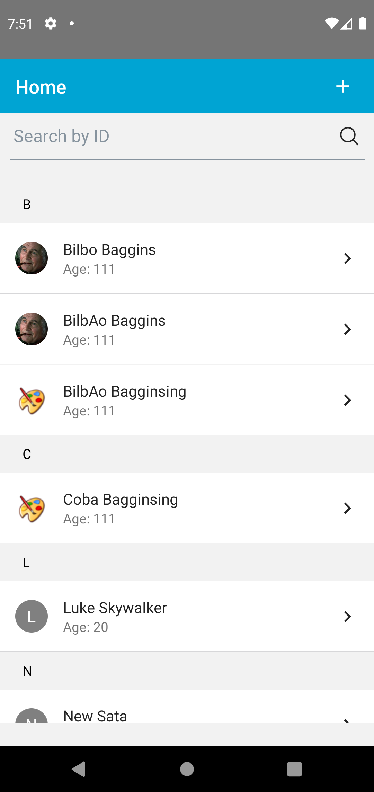
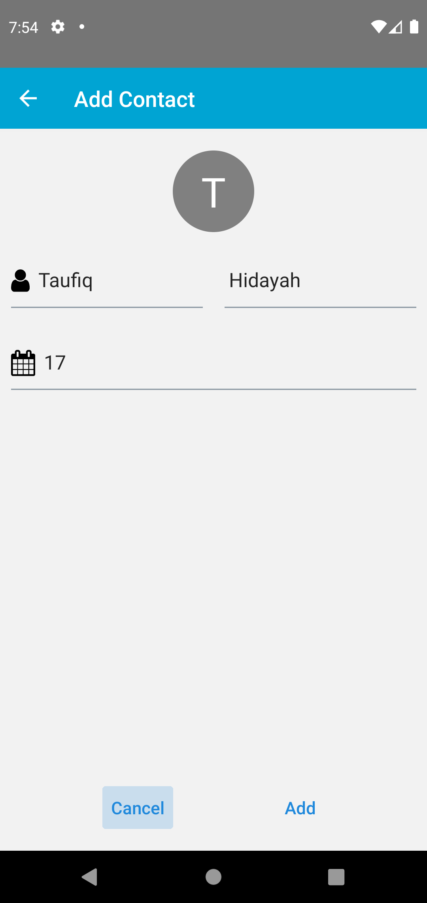
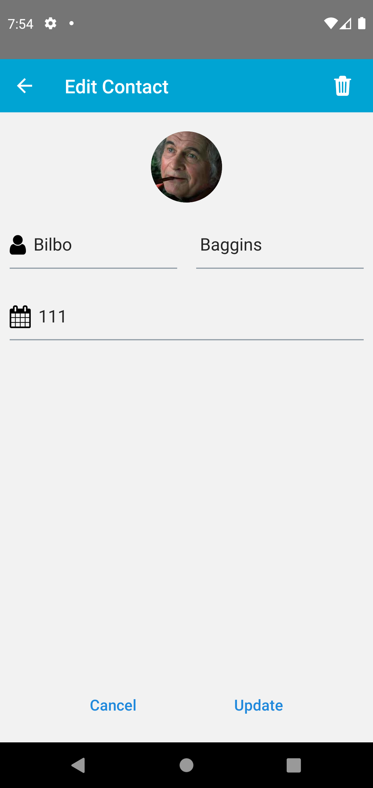
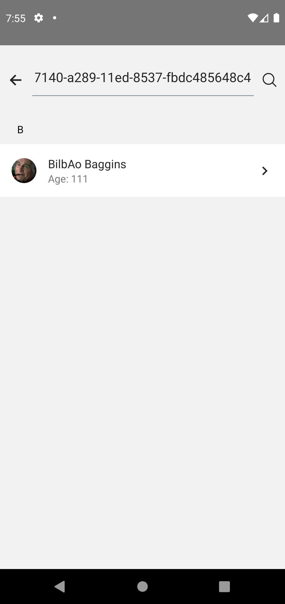
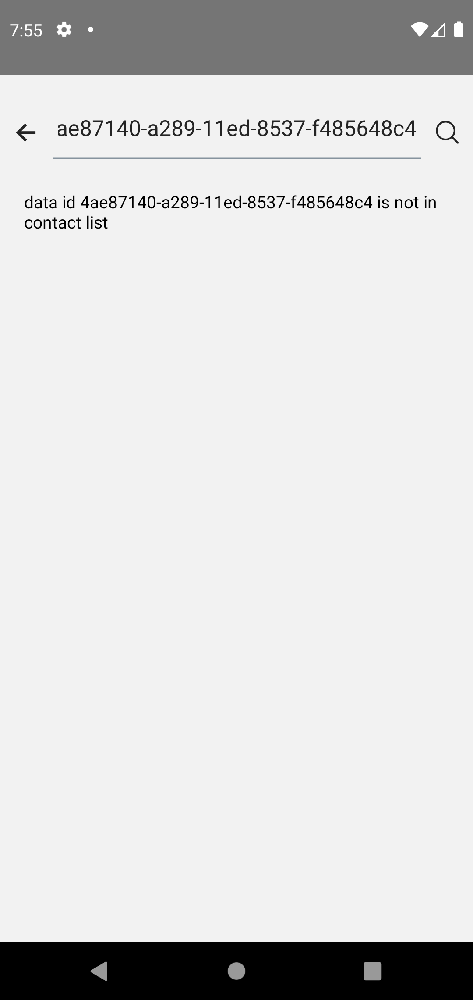

# iContact

iContact is a user-friendly application that helps you easily save and manage your friends' contacts in one convenient place.


## Features

>>


- Getdata contact
- Search contact by id
- Add contact
- Edit contact
- Delete contact *sometimes got trouble from API


## Tech Stack

**Client:** React Native, Redux, Thunk, React Native Element, React Navigation, React Native Testing library.
## Steps to run project

* Install package

```bash
  npm install
```

* Running app

```bash
  npx react-native run-android
```

## Demo

Download Android APK [HERE](src/assets/iContact.apk)


* Home


* Add


* Edit


* Search Data


* Search Data not found


> images only work in https protocol
## Authors

- [@taufiqhidayah](https://www.github.com/taufiqhidayah)

